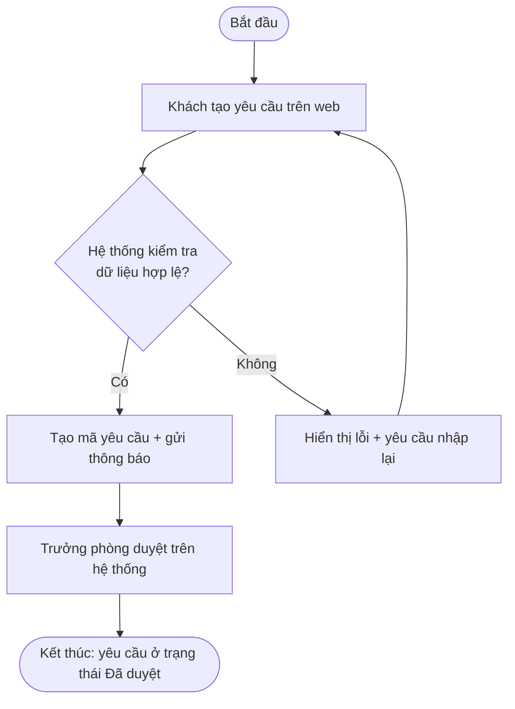

# 4.4 — Process Flow / User Journey

> **Cách dựng (theo tài liệu gốc):** AI vẽ nháp từ transcript/biên bản họp, BA review và sửa lại. Bắt buộc kiểm bằng `rules/bpm-rules.md` trước khi gửi xác nhận. Sản phẩm dùng làm đầu vào cho `spec.md` (B4) và làm cơ sở kiểm thử ở B11.
>
> **Áp dụng cho dự án:** [Tên dự án] · **Người dựng:** [Tên] · **Ngày:** [Ngày] · **Người xác nhận (PO/khách hàng):** [Tên khách hàng]

## 1. Quy tắc bắt buộc

| Quy tắc | Nội dung |
|---|---|
| **Ngưỡng vẽ BPMN đầy đủ** | Luồng > **3 actor** hoặc > **2 điểm rẽ nhánh** → **bắt buộc** BPMN đầy đủ (có swimlane), không dùng User Journey Map rút gọn |
| **Không nhánh cụt** | Mọi Gateway phải có đường vào và đường ra; mọi nhánh phải dẫn tới kết thúc hoặc bước tiếp theo |
| **Gateway phải có nhãn** | Mọi nhánh ra của hình thoi phải ghi điều kiện (Có/Không, hoặc điều kiện cụ thể) |
| **Actor rõ ràng** | Mọi bước ghi rõ ai làm: người (vai trò nào) hay hệ thống |
| **Đối chiếu As-is/To-be** | Phải chỉ ra khác biệt cụ thể, không chỉ vẽ To-be |

## 2. Ký hiệu (BPMN 2.0)

| Ký hiệu | Tên | Dùng khi |
|---|---|---|
| ⬭ Oval | Start / End Event | Điểm bắt đầu, điểm kết thúc |
| ▭ Chữ nhật | Task / Activity | Hành động cụ thể (động từ + đối tượng) |
| ◇ Hình thoi | Gateway | Điểm rẽ nhánh — **bắt buộc có nhãn điều kiện** |
| ▭ gấp góc | Sub-process | Nhóm bước (có sơ đồ con riêng) |
| Dải ngang | Swimlane / Pool | Phân biệt actor — bắt buộc khi > 3 actor |

## 3. Bảng As-is / To-be

| # | Hoạt động | As-is (hiện tại) | To-be (sau khi làm) | Khác biệt | Lợi ích kỳ vọng |
|---|---|---|---|---|---|
| 1 | [Tiếp nhận yêu cầu] | [Khách gọi điện/nhắn Zalo, nhân viên ghi tay vào sổ] | [Khách tạo yêu cầu trên web, hệ thống sinh mã + thông báo] | [Bỏ bước ghi tay; có mã theo dõi] | [Giảm thất lạc yêu cầu; tra cứu được] |
| 2 | [Kiểm tra thông tin] | [Nhân viên tra Excel, mất ~10 phút/đơn] | [Hệ thống tra tự động, nhân viên chỉ xác nhận] | [Tự động hoá tra cứu] | [Giảm 10 phút → ~1 phút/đơn] |
| 3 | [Duyệt] | [Trưởng phòng duyệt qua tin nhắn, không lưu vết] | [Duyệt trên hệ thống, ghi log ai duyệt khi nào] | [Có audit log] | [Truy vết được, không chối bỏ được] |
| 4 | [Thông báo kết quả] | [Gọi điện hoặc nhắn tay, hay quên] | [Hệ thống tự thông báo] | [Tự động] | [Không sót thông báo] |

**Bước nào bị BỎ** (ghi rõ để không mang nợ cũ sang hệ thống mới): [ ]

**Bước nào được THÊM MỚI**: [ ]

## 4. Mẫu Process Flow (Mermaid)

Ví dụ luồng 2 actor, 1 điểm rẽ nhánh → dùng bản rút gọn được:



Kiểm luồng trên: 1 actor người + 1 hệ thống = 2 actor (≤ 3), 1 gateway (≤ 2) → **bản rút gọn được phép**. Không có nhánh cụt; nhánh "Không" quay lại B (có đường đi tiếp).

Ví dụ luồng vượt ngưỡng → **phải dùng BPMN đầy đủ có swimlane**:

```
Actor: Khách | Nhân viên CSKH | Hệ thống | Trưởng phòng | Kế toán
       (5 actor > 3 → bắt buộc swimlane, không dùng journey map)
```

## 5. Mẫu User Journey Map (rút gọn)

Dùng khi luồng ≤ 3 actor và ≤ 2 điểm rẽ nhánh, để thấy điểm đau của người dùng.

| Giai đoạn | Hành động người dùng | Điểm chạm (touchpoint) | Cảm xúc | Điểm đau (pain point) | Cơ hội cải thiện |
|---|---|---|---|---|---|
| Nhận biết | [Nghe giới thiệu từ đồng nghiệp] | [Website, Zalo] | 🙂 Trung tính | [Không biết mất bao lâu] | [Ghi rõ thời gian xử lý trên web] |
| Tìm hiểu | [Đọc thông tin dịch vụ] | [Website] | 😕 Bối rối | [Thông tin rải rác nhiều trang] | [Gộp vào 1 trang; có bảng so sánh gói] |
| Đăng ký | [Điền form đăng ký] | [Form trên web] | 🙂 Trung tính | [Phải nhập lại thông tin đã có] | [Tự động điền; cho lưu nháp] |
| Chờ xử lý | [Chờ phản hồi] | [Email/điện thoại] | 😟 Lo lắng | [Không biết đang xử lý đến đâu] | [Trang tra cứu trạng thái; thông báo tiến độ] |
| Hoàn tất | [Nhận kết quả] | [Email + hệ thống] | 😊 Hài lòng | — | [Gửi xác nhận kèm hướng dẫn bước tiếp theo] |

**Ghi chú dùng bảng:** cảm xúc lấy từ phỏng vấn thật (`4.1-interview-guide.md`) hoặc observation — **không tự suy đoán**. Nếu chưa có dữ liệu, để trống và ghi "cần xác minh".

## 6. Quy tắc chuyển sang tài liệu khác

| Đầu ra của bước này | Đi vào đâu |
|---|---|
| Danh sách actor | `4.3-BRD.md` — phần Stakeholder |
| Bước nghiệp vụ | `4.3-BRD.md` — phần Functional Requirements |
| Quy tắc rẽ nhánh (điều kiện gateway) | `spec.md` (B4) — Business Rules |
| Điểm đau người dùng | User Story + ưu tiên MoSCoW |
| Trạng thái của đối tượng nghiệp vụ | Thiết kế data model (B6) |

## 7. Checklist trước khi xác nhận với PO

- [ ] Có đúng 1 điểm bắt đầu và điểm kết thúc rõ ràng
- [ ] Mọi bước ghi rõ actor (người/hệ thống)
- [ ] Mọi Gateway có nhãn điều kiện ở tất cả nhánh ra
- [ ] Không có nhánh cụt
- [ ] Số actor > 3 hoặc gateway > 2 → đã dùng BPMN đầy đủ có swimlane
- [ ] Đã có bảng As-is/To-be với khác biệt cụ thể
- [ ] Đã ghi rõ bước bị bỏ / bước thêm mới
- [ ] Thuật ngữ khớp `glossary.md`
- [ ] Đã chạy `rules/bpm-rules.md` và không còn mục "Không đạt"
- [ ] Đã gửi PO/khách hàng xác nhận bằng văn bản (ghi vào `4.5-QA-log.md`)

## Nguồn tham chiếu

- AI-SDLC v5.9, Phụ lục 4 mục 4.4 — tài liệu gốc nội bộ
- BPMN 2.0 Specification, OMG — https://www.omg.org/spec/BPMN/
- BPMN 2.0 Quick Guide — https://www.bpmnquickguide.com/
- BABOK v3, IIBA — Process Modelling, User Journey — https://www.iiba.org/
- Mermaid — flowchart syntax — https://mermaid.js.org/syntax/flowchart.html
- NN/g — Journey Mapping 101 — https://www.nngroup.com/articles/journey-mapping-101/
