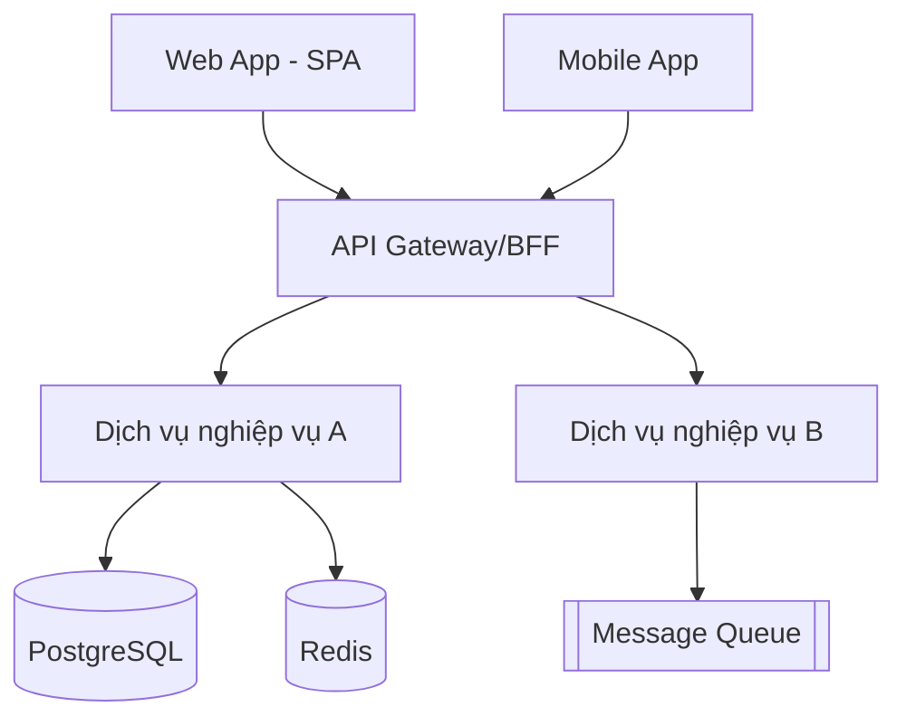
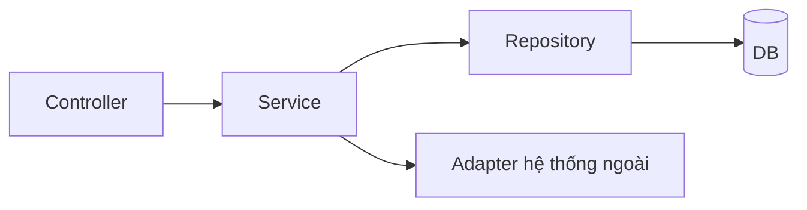
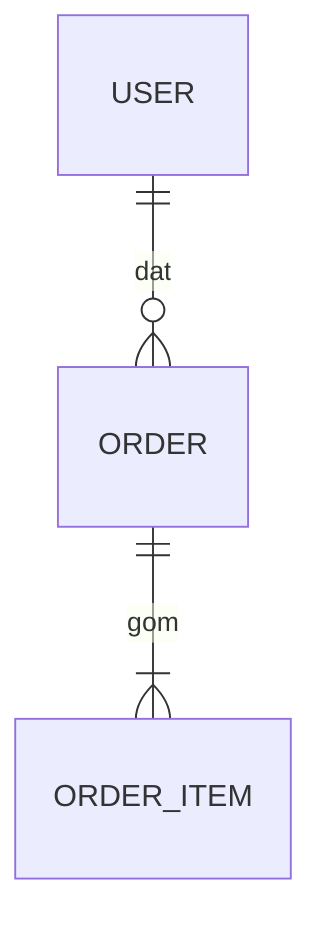

# Kế hoạch triển khai: [Tên tính năng]

**Nhánh**: `[###-ten-tinh-nang]` | **Ngày**: [Ngày] | **Spec**: `./spec.md` (đã qua Gate 1)

**Đầu vào**: Đặc tả tính năng tại `specs/[###-ten-tinh-nang]/spec.md`

> Cảnh báo Gate 2: mục đích của bước này là chặn **"architecture by autocomplete"** — Tech Lead phải đọc, sửa và chịu trách nhiệm cho từng quyết định kiến trúc, không merge nguyên văn đề xuất của AI.

---

## 1. Tóm tắt (Summary)

[Trích từ spec: yêu cầu chính + hướng tiếp cận kỹ thuật rút ra từ nghiên cứu]

---

## 2. Bối cảnh kỹ thuật (Technical Context)

| Hạng mục | Giá trị |
|---|---|
| Ngôn ngữ / Phiên bản | [ví dụ Node.js 22 LTS, Java 21, Python 3.12 hoặc **CẦN LÀM RÕ**] |
| Thư viện / Phụ thuộc chính | [ví dụ NestJS, Spring Boot, FastAPI hoặc **CẦN LÀM RÕ**] |
| Lưu trữ | [ví dụ PostgreSQL 16, Redis, S3 hoặc N/A] |
| Kiểm thử | [ví dụ Jest, JUnit, pytest, Playwright hoặc **CẦN LÀM RÕ**] |
| Nền tảng mục tiêu | [ví dụ Linux container, trình duyệt Chrome/Edge, iOS 16+ hoặc **CẦN LÀM RÕ**] |
| Loại dự án | [thư viện / CLI / web-service / mobile-app / desktop-app] |
| Mục tiêu hiệu năng | [ví dụ p95 ≤ 300 ms, 1000 req/s hoặc **CẦN LÀM RÕ**] |
| Ràng buộc | [ví dụ < 200 ms p95, < 100 MB RAM, chạy offline] |
| Quy mô / Phạm vi | [ví dụ 10k người dùng, 50 màn hình, 200k dòng code] |

---

## 3. Kiểm tra Hiến chương (Constitution Check)

*CỔNG: phải đạt TRƯỚC khi sang thiết kế chi tiết. Kiểm lại sau khi hoàn tất C4/ADR.*

| Điều khoản constitution.md | Đạt? | Ghi chú / Miễn trừ |
|---|---|---|
| [Nguyên tắc 1: ví dụ mọi thay đổi schema phải có migration] | [ ] | [Ghi chú] |
| [Nguyên tắc 2: ví dụ không thêm dependency chưa qua đánh giá security] | [ ] | [Ghi chú] |
| [Nguyên tắc 3: bảo mật theo OWASP ASVS Level [X]] | [ ] | [Ghi chú] |

---

## 4. C4 Model — Kiến trúc

### 4.1 Level 1 — System Context (Bối cảnh hệ thống)

```mermaid
flowchart TB
    U[Người dùng cuối] --> S[([Tên hệ thống])]
    A[Quản trị viên] --> S
    S --> E1[Hệ thống ngoài: ví dụ cổng thanh toán]
    S --> E2[Hệ thống ngoài: ví dụ dịch vụ email]
```

| Thành phần | Loại | Mô tả | Giao thức |
|---|---|---|---|
| [Người dùng cuối] | Actor | [Mô tả] | [HTTPS] |
| [Tên hệ thống] | System | [Hệ thống đang xây] | — |
| [Hệ thống ngoài] | External System | [Mục đích] | [REST / SFTP / SMTP] |

### 4.2 Level 2 — Container (Vùng chứa)



| Container | Công nghệ | Trách nhiệm | Ghi chú |
|---|---|---|---|
| [Web App] | [React 19 + Vite] | [Trách nhiệm] | [SPA, SSR?] |
| [API Gateway] | [Nginx/Kong] | [Định tuyến, xác thực] | — |
| [Dịch vụ A] | [NestJS] | [Nghiệp vụ] | [Stateless] |
| [Cơ sở dữ liệu] | [PostgreSQL 16] | [Lưu trữ bền vững] | [Backup hằng ngày] |

### 4.3 Level 3 — Component (Thành phần)

Chỉ vẽ chi tiết cho container chạm luồng nghiệp vụ chính:



| Component | Thuộc container | Trách nhiệm | File dự kiến |
|---|---|---|---|
| [Controller] | [Dịch vụ A] | [Xử lý HTTP, validate] | `[src/...]` |
| [Service] | [Dịch vụ A] | [Logic nghiệp vụ] | `[src/...]` |
| [Repository] | [Dịch vụ A] | [Truy cập dữ liệu] | `[src/...]` |

### 4.4 Level 4 — Code (tuỳ chọn)

Chỉ vẽ khi class diagram giúp làm rõ logic phức tạp. Không bắt buộc.

---

## 5. Quyết định kiến trúc (ADR)

Mỗi ADR tách file riêng theo `../phu-luc/adr-template.md` (MADR), liệt kê tại đây:

| Mã | Tiêu đề | Trạng thái | Ngày | Liên quan |
|---|---|---|---|---|
| ADR-001 | [Chọn PostgreSQL thay vì MySQL] | Accepted | [Ngày] | [B6] |
| ADR-002 | [Dùng hàng đợi cho xử lý bất đồng bộ] | Proposed | [Ngày] | [B6] |
| ADR-003 | [Chiến lược xác thực bằng JWT + refresh token] | Accepted | [Ngày] | [B6] |

**ADR tối thiểu phải ghi**: bối cảnh → quyết định → hệ quả (Consequences) → phương án đã loại + lý do.

---

## 6. Mô hình dữ liệu (ERD)



| Thực thể | Thuộc tính chính | Khoá | Ghi chú |
|---|---|---|---|
| [USER] | id, email, created_at | PK id | [PII? Có → cần mask] |
| [ORDER] | id, user_id, status, total | PK id, FK user_id | [Index trên status] |

**Chiến lược migration**: [ví dụ Flyway/Prisma — mọi thay đổi qua PR, có đường rollback]

---

## 7. Đặc tả API (OpenAPI 3.x)

File: `specs/[###-ten-tinh-nang]/contracts/openapi.yaml`

| Method | Path | Mục đích | Auth | AC liên quan |
|---|---|---|---|---|
| GET | `/api/v1/[resource]` | [Danh sách] | Bearer | AC-001 |
| POST | `/api/v1/[resource]` | [Tạo mới] | Bearer | AC-002 |
| PUT | `/api/v1/[resource]/{id}` | [Cập nhật] | Bearer | AC-003 |

**Quy ước chung**: version qua URL `/v1`; lỗi theo RFC 7807 (problem+json); phân trang `page`/`pageSize`; mọi endpoint ghi log audit.

---

## 8. Cấu trúc mã nguồn (Source Code Structure)

```text
[backend/]
├── src/
│   ├── modules/[module]/
│   └── shared/
└── tests/
    ├── unit/
    ├── integration/
    └── e2e/

[frontend/]
├── src/
│   ├── features/[feature]/
│   └── shared/
└── e2e/
```

---

## 9. Chiến lược kiểm thử & triển khai

| Nội dung | Quyết định |
|---|---|
| Đơn vị (Unit) | [pytest/Jest — ngưỡng coverage [X]%] |
| Tích hợp (Integration) | [Testcontainers / DB test riêng] |
| E2E | [Playwright — luồng chính] |
| Hiệu năng | [k6/JMeter — ngưỡng NFR-001] |
| CI/CD | [GitHub Actions → build once → promote artifact] |
| Môi trường | DEV → CI/TEST → STAGING → UAT → PRODUCTION (không rebuild) |

---

## 10. Rủi ro kỹ thuật

| # | Rủi ro | Xác suất | Tác động | Giảm thiểu |
|---|---|---|---|---|
| R1 | [Tích hợp hệ thống ngoài chậm/lỗi] | [Cao/TB/Thấp] | [Cao] | [Circuit breaker + retry + timeout] |
| R2 | [Khối lượng dữ liệu vượt dự báo] | [TB] | [TB] | [Index + phân vùng + load test sớm] |
| R3 | [Thiếu kỹ năng công nghệ mới] | [TB] | [TB] | [Spike 1 ngày trước khi cam kết] |

**Spike cần làm trước**: [ ] [Mô tả spike + thời lượng]

---

## 11. Checklist ký duyệt — Gate 2

- [ ] plan.md hoàn chỉnh, Tech Lead đã sửa (không merge nguyên văn AI)
- [ ] ADR đã qua kiểm tự động bằng `adr-rules.md`
- [ ] OpenAPI đã qua kiểm bằng `api-rules.md`, validate bằng Spectral/Swagger
- [ ] C4 Level 1–3 đã có, ERD khớp data model trong spec
- [ ] Constitution Check đạt (không có miễn trừ chưa được duyệt)
- [ ] Design Review với Dev senior đã diễn ra (khuyến khích)
- [ ] Đã commit plan.md/ADR/C4/OpenAPI vào repo
- [ ] Tech Lead (hoặc Architect/CTO) đã ký Gate 2

---

## Nguồn tham chiếu

- AI-SDLC v5.9 — B6 GATE 2 (dòng 626–680)
- GitHub Spec Kit — `refs/spec-kit-plan.md`, lệnh `/speckit.plan`
- C4 Model — Simon Brown (Context, Container, Component, Code)
- MADR — `refs/madr-template.md`, `refs/madr-minimal.md`
- OpenAPI Specification 3.x — openapis.org
- `../rules/constitution.md` · `../phu-luc/adr-template.md` (PL 3.3) · `../rules/adr-rules.md` (PL 3.11) · `../rules/api-rules.md` (PL 3.12)
